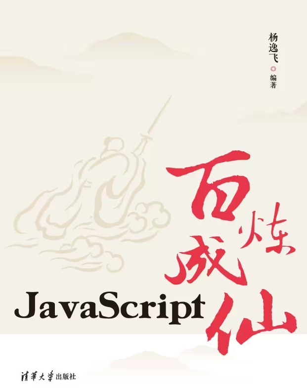

# 好书推荐

***记录一下我遇到的有益、有意思或打发时间的书或文。***

这里面有穿越者必备的三大神书，有各种令人头大的工具书，当然还有纯粹的爽文:(far fa-grin-squint-tears):。

<!--more-->


 本文档只为记录个人遇到的好书，如若侵权请务请联系作者删除！


## 1 神书{#god}

这里记录公认或个人认为可以封神的书或文。

### 1.1 穿越必备三大神书系列

#### 赤脚医生手册

#### 民兵训练手册

#### 军地两用人才之友

朋友，你想象过穿越回古代吗？回到过去，上马治军，下马安民，不上不下就从商，富甲一方，皇帝都要找你借钱修园子！醒醒吧，你肩不能挑，手不能提，五谷不分，四体不勤，真的回到古代也就是一个特殊一点的屁民，除非，你回去的时候带上了这三本神书！

**下载链接：**

- [70版民兵军事训练手册.pdf](https://gitee.com/lizilong1993/image/raw/master/202111040936586.pdf)
- [76版民兵训练手册.pdf](https://gitee.com/lizilong1993/image/raw/master/202111040936158.pdf)
- [赤脚医生手册（湖南）.pdf](https://gitee.com/lizilong1993/image/raw/master/202111040944010.pdf)
- [赤脚医生手册.pdf](https://gitee.com/lizilong1993/image/raw/master/202111040945692.pdf)
- [军地两用人才之友续编本.pdf](https://gitee.com/lizilong1993/image/raw/master/202111040946913.pdf)


我在百度的过程中发现也有人认为这三本神书分别是《参谋助手论——为首长服务的艺术》、《军地两用人才之友》和《赤脚医生手册》。









### 1.2 未完待续

## 2 工具书{#tool}

### 2.1 编程

#### JavaScript百炼成仙

在线阅读地址1：[JavaScript百炼成仙最新章节_杨逸飞著_掌阅小说网 (zhangyue.com)](https://m.zhangyue.com/readbook/12567484/5.html)

在线阅读地址2[免费]：[JavaScript百炼成仙](https://www.aliyundrive.com/s/jHypi9UeK5x)

[下载链接](https://gitee.com/lizilong1993/image/raw/master/202111180934100.pdf)


 作者写书不易，请有能力的同学购买正版书籍


## 3 爽文 {#happy}

### 3.1 网络小说

#### 3.1.1 无限流

- [我在惊悚游戏里封神.txt](https://gitee.com/lizilong1993/image/raw/master/202111221423856.txt)

​        白柳在失业后被卷入一个无法停止的直播游戏中，游戏中充满了各种各样的怪物和蕴含杀意的玩家一开始所有人都以为白柳只是个误入游戏的普通人后来，他们才明白，是这个游戏用胜利和桂冕在恭迎属于它的神明，对白柳说，欢迎回家。

#### 3.1.2 诡异流

- [诡异世界生存手册.txt](https://gitee.com/lizilong1993/image/raw/master/202112021337818.txt)

### 3.2 白话小说

#### 3.2.1 神野志怪

- [《醉茶志怪》白话文版.txt](https://gitee.com/lizilong1993/image/raw/master/202112021335997.txt)

## 4 未完待续{#to_be_continued}

未完待续，欢迎补充！:(far fa-laugh-beam):

## 参考资料{#ref}

万分感谢：

- [近代的三本神书，带着它们穿越古代，一人之下，万人之上不是梦 (baidu.com)](https://baijiahao.baidu.com/s?id=1660856482842558001&wfr=spider&for=pc)

